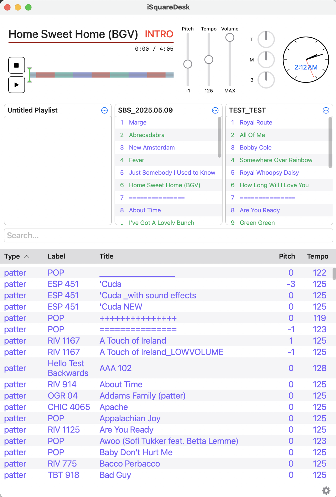
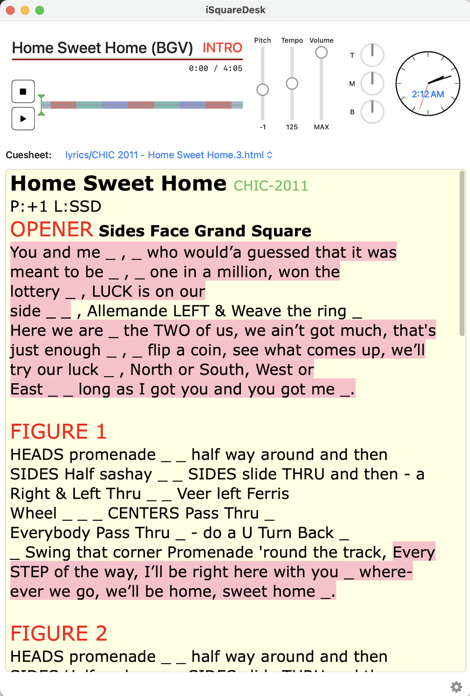

# iSquareDesk

iSquareDesk is an iPad app for square dance callers. It plays music, manages playlists, and displays cuesheets with smart helpers like auto‑scroll and zoom.

This repository contains the SwiftUI iPad app. The legacy Qt sources are intentionally ignored and not part of this repo.

## Highlights

- Playback with tempo and pitch control (AVAudioEngine).
- 3‑band EQ and volume control with VU meter.
- Song browser with sorting and search.
- Playlists (CSV import) with three quick‑access slots.
- Cuesheet viewer (HTML via WKWebView):
  - Auto‑scrolls to match the song playhead between intro and outro.
  - Anchors “OPENER” at intro; last line visible at outro.
  - Smooth scrolling and linear interpolation in‑between.
  - Zoom (percent) with a stepper.
  - Resets to the very top on STOP and when playback reaches the end.
- Optional auto‑switch to Cuesheet tab when a singing call starts playing.
- Time‑in‑tip timer for patter.

## Screenshots

Place your screenshots under `Screenshots/` in the repository. Example embeds below assume:

## Requirements

- macOS with Xcode 16.4 or newer.
- iOS/iPadOS 18 (Deployment Target: 18.0/18.5 in project settings).
- Swift Package Manager resolves dependencies (GRDB).

## Building & Running

1) Clone the repo and open the project:
   - `git clone https://github.com/mpogue2/iSquareDesk.git`
   - `open iSquareDesk/iSquareDesk.xcodeproj`

2) Select an iPad simulator or a connected iPad device.

3) Build and Run from Xcode.

## First‑Run Setup (Music Library)

The app reads your music library from a folder you choose at runtime (no media is bundled in the app):

- Open Settings (gear icon) → “Select Folder”.
- Choose your `SquareDanceMusic` folder that contains a `.squaredesk` subfolder.  This folder is
    the same folder that you created for the SquareDesk desktop application.  You can share
    that folder between your MacOS laptop and your iPad using iCloud.  The iSquareDesk iPad app
    will not save any changes right now to the database, so changes to Pitch, Tempo, and EQ will
    currently not persist.  
- The app requests security‑scoped access and indexes your music and cuesheets.

## Cuesheets

- Place cuesheets as HTML files in your music folder (e.g. under `lyrics/`, `singing/`, or `singers/`).
- The app matches cuesheets to songs by filename heuristics.
- Auto‑scroll uses:
  - Intro anchor: the first element containing the text “OPENER”.
  - Outro anchor: the bottom of the page.
  - Between intro and outro: linear interpolation tied to the playhead, including taps on the seekbar.
- At STOP or when the song reaches its end, the view scrolls all the way back to the top.

## Settings

- Force Mono: Convert playback to mono.
- Switch to Cuesheet on first play: When a singing call starts playing, switch to the Cuesheet tab.
- Auto‑scroll cuesheet: Keep the cuesheet position synced to the playhead.
- Cuesheet Zoom: Percent (e.g. 120 → 1.2×). Includes a stepper (±5%).
- Music Folder: Choose and persist your library root.

## Playlists

- Import CSV playlists into one of three slots (see UI under the main view).
- CSVs are read from within your music folder (paths resolved relative to it).

## Project Layout

- `iSquareDesk/iSquareDesk/…` — SwiftUI app sources.
- `Resources/` — project resources (no secrets, no media).
- `Sources/main.swift` — entry used by Swift Package/Xcode scaffolding.
- `Qt_source/` — ignored (legacy/experimental code not included in Git).
- `SquareDanceMusic/` — ignored (your music library; not in Git).

## License

Each Swift file contains the iSquareDesk license header describing Commercial and GPL usage options. To distribute under GPL, include copies of `LICENSE.GPL2` and `LICENSE.GPL3` in your distribution as referenced by the headers.

Note: This repository does not ship copyrighted music or cuesheets. Do not commit media into the repo.

## Contributing

Pull requests and issues are welcome. Please avoid including any copyrighted media or private data in submissions. If you plan larger changes, open an issue first for discussion.

## Security / Privacy

- No analytics or tracking.
- No API keys or secrets are stored in the repo.

## Troubleshooting

- Auto‑scroll not moving: ensure “Auto‑scroll cuesheet” is enabled and your cuesheet contains “OPENER”.
- Zoom direction: 120% zooms in; 75% zooms out.
- Can’t see cuesheets: verify the selected music folder contains your HTML files, and that the app has security‑scoped access.
